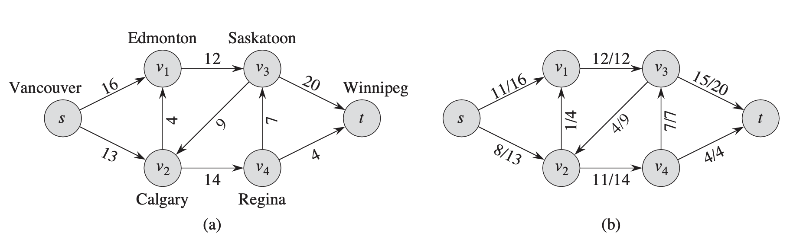
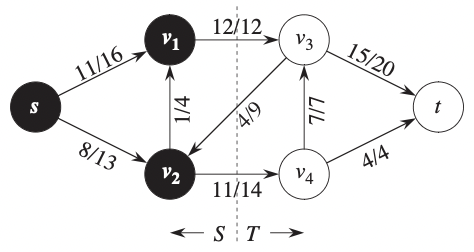

# Maxflow

## Flow Graph

A flow network $G = (V, E)$ is a directed graph in which each edge $(u, v) \in E$ has a nonnegative capacity $(u, v) > 0$.

We distinguish two vertices in a flow network: a source $s$ and a sink $t$. We assume that each vertex lies on some path from the source to the sink. That is, for each vertex $v \in V$, the flow network contains a path $s \rightarrow v \rightarrow t$.

The graph is therefore connected and, since each vertex other than s has at least one entering edge, $|E|\geq |V| - 1$.

	
	

	

- A flow in G is a real-valued function $f : V \times V  \rightarrow \mathbb{R}$ that satisfies the following properties:

  - **Capacity constraint**: For all $u, v \in V$, we require $0 \leq f(u, v) \leq c(u,v)$
  - **Flow conservation**: For all $u \in V - \{s, t\}$, we require
    $$\sum_{v\in V, f(v, u) > 0} f(v, u) = \sum_{v\in V, f(u, v) > 0} f(u, v)$$
  - **Skew symmetry**: For all vertices u,v we require $f(u,v) = - f(v,u)$
  - Example of Flow conservation:

    For above graph, we have $v \in \{s, v_1, \cdots, v_4, t\}$, and $u \in \{v_1, \cdots, v_4\}$.
    $$\sum_{v\in V, f(v, u) > 0} f(v, u) = f(s, v_1) + f(s, v_2) + f(v_2, v_1) + f(v_1, v_3) + f(v_3, v_2) + f(v_2, v_4) + f(v_4, v_3)$$

    $$\sum_{v\in V, f(u, v) > 0} f(u, v) = f(v3, t) + f(v_4, t) + f(v_2, v_1) + f(v_1, v_3) + f(v_3, v_2) + f(v_2, v_4) + f(v_4, v_3)$$

## MaxFlow

### Flow

We call the nonnegative quantity $f(u, v)$ the flow from vertex $u$ to vertex $v$. The value $|f|$ of a flow $f$ is defined as:

$$
|f| = \sum_{v\in V^-}f(s, v) = \sum_{v\in V^-}f(v, t)
$$

### Residual Network

Given a flow network $G$ and a flow $f$ , the residual network $G_f$ consists of edges with capacities that represent how we can change the flow on edges of $G$.

### Argument path

Given a flow network $G = (V,E)$ and a flow $f$, an augmenting path $p$ is a simple path from $s$ to $t$ in the residual network $G_f$.

### Cut

A cut $(S,T)$ is a partition of the vertices such that $s\in S$ and $t \in T$.

- The capacity of cut $(S,T)$ is
  $$
  c(S,T) = \sum_{u\in S, v \in T}c(u, v)
  $$
- The net flow across cut $(S,T)$ is:

$$
f(S, T) = \sum_{u \in S} \sum_{v \in T} f(u, v) - \sum_{u \in S} \sum_{v \in T} f(v, u)
$$

For example, in the below graph, $S = \{s, v_1, v_2 \}, T = \{v_3, v_4, t\}$.

	
	

	

$$
\begin{aligned}
    c(S,T) &= c(v_1, v_3) + c(v_2, v_4)\\
    &= 12 + 14 \\
    &= 26\\
    f(S,T) &= f(v_1, v_3) + f(v_2, v_4) - f(v_3, v_2)\\
    &= 12 + 11 - 4\\
    &= 19
\end{aligned}
$$

### MaxFlow problem

We are given a flow network $G$ with source $s$ and sink $t$, and we wish to find a flow of maximum value.
